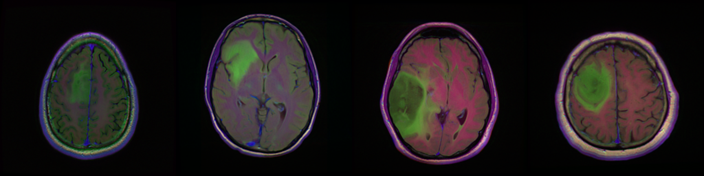
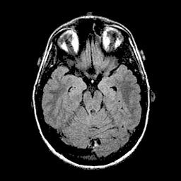
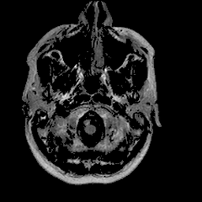
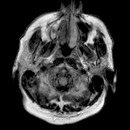

# U-Net for brain segmentation

U-Net implementation in PyTorch for FLAIR abnormality segmentation in brain MRI based on a deep learning segmentation algorithm used in [Association of genomic subtypes of lower-grade gliomas with shape features automatically extracted by a deep learning algorithm](https://doi.org/10.1016/j.compbiomed.2019.05.002).

This repository is an all Python port of official MATLAB/Keras implementation in [brain-segmentation](https://github.com/mateuszbuda/brain-segmentation).
Weights for trained models are provided and can be used for inference or fine-tuning on a different dataset.
If you use code or weights shared in this repository, please consider citing:

```
@article{buda2019association,
  title={Association of genomic subtypes of lower-grade gliomas with shape features automatically extracted by a deep learning algorithm},
  author={Buda, Mateusz and Saha, Ashirbani and Mazurowski, Maciej A},
  journal={Computers in Biology and Medicine},
  volume={109},
  year={2019},
  publisher={Elsevier},
  doi={10.1016/j.compbiomed.2019.05.002}
}
```

## docker

```
docker build -t brainseg .
```

```
nvidia-docker run --rm --shm-size 8G -it -v `pwd`:/workspace brainseg
```

## PyTorch Hub

Loading model using PyTorch Hub: [pytorch.org/hub/mateuszbuda\_brain-segmentation-pytorch\_unet](https://pytorch.org/hub/mateuszbuda_brain-segmentation-pytorch_unet/)

```python
import torch
model = torch.hub.load('mateuszbuda/brain-segmentation-pytorch', 'unet',
    in_channels=3, out_channels=1, init_features=32, pretrained=True)
```

## data



Dataset used for development and evaluation was made publicly available on Kaggle: [kaggle.com/mateuszbuda/lgg-mri-segmentation](https://www.kaggle.com/mateuszbuda/lgg-mri-segmentation).
It contains MR images from [TCIA LGG collection](https://wiki.cancerimagingarchive.net/display/Public/TCGA-LGG) with segmentation masks approved by a board-certified radiologist at Duke University.

## model

A segmentation model implemented in this repository is U-Net as described in [Association of genomic subtypes of lower-grade gliomas with shape features automatically extracted by a deep learning algorithm](https://doi.org/10.1016/j.compbiomed.2019.05.002) with added batch normalization.


## results

||||
|:-------:|:-------:|:-------:|
| 94% DSC | 91% DSC | 89% DSC |

Qualitative results for validation cases from three different institutions with DSC of 94%, 91%, and 89%.
Green outlines correspond to ground truth and red to model predictions.
Images show FLAIR modality after preprocessing. 


Distribution of DSC for 10 randomly selected validation cases.
The red vertical line corresponds to mean DSC (91%) and the green one to median DSC (92%).
Results may be biased since model selection was based on the mean DSC on these validation cases.

## inference

1. Download and extract the dataset from [Kaggle](https://www.kaggle.com/mateuszbuda/lgg-mri-segmentation).
2. Run docker container.
3. Run `inference.py` script with specified paths to weights and images. Trained weights for input images of size 256x256 are provided in `./weights/unet.pt` file. For more options and help run: `python3 inference.py --help`.

## train

1. Download and extract the dataset from [Kaggle](https://www.kaggle.com/mateuszbuda/lgg-mri-segmentation).
2. Run docker container.
3. Run `train.py` script. Default path to images is `./kaggle_3m`. For more options and help run: `python3 train.py --help`.

Training can be also run using Kaggle kernel shared together with the dataset: [kaggle.com/mateuszbuda/brain-segmentation-pytorch](https://www.kaggle.com/mateuszbuda/brain-segmentation-pytorch).
Due to memory limitations for Kaggle kernels, input images are of size 224x224 instead of 256x256.

Running this code on a custom dataset would likely require adjustments in `dataset.py`.
Should you need help with this, just open an issue.

## TensorRT inference

If you want to run the model inference with TensorRT runtime, here is a blog post from Nvidia that covers this: [Speeding Up Deep Learning Inference Using TensorRT](https://developer.nvidia.com/blog/speeding-up-deep-learning-inference-using-tensorrt/).
